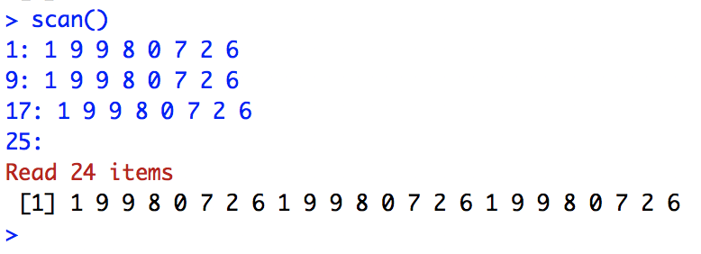

## Vectores
Un **vector** es una secuencia ordenada de datos. `R` dispone de muchos tipos de datos, por ejemplo:

- `logical`: lógicos (```TRUE``` o ```FALSE```)
- `integer`: números enteros, $\mathbb Z$
- `numeric`: números reales, $\mathbb R$
- `complex`: números complejos, $\mathbb C$
- `character`: palabras

En los vectores de `R`, todos sus objetos han de ser del mismo tipo: todos números, todos palabras, etc. Cuando queramos usar vectores formados por objetos de diferentes tipos, tendremos que usar **listas generalizadas**, `lists` que veremos al final del tema.

- ```c()```: para definir un vector.
- ```scan()```: para definir un vector. Con el doble \textit{Enter} finalizamos la escritura de datos.
- ```fix(x)```: para modificar visualmente el vector $x$. Tenemos que guardar los cambios. 
- ```rep(a,n)```: para definir un vector constante que. contiene el dato $a$ repetido $n$ veces.

**Ejemplos**
- **c()**: Vector con entradas enteras 1, 2 y 3 y otro con puros nombres.
```{r}
c(1,2,3)
c("Tony","Jacob","Lex")
```

- **rep()**: Vector con entradas iguales al texto "Mates" repetido 7 veces.
```{r}
rep("Mates",7)
```

- **scan()**: Vamos a crear un vector que contenga 3 copias de 1 9 9 8 0 7 2 6 con la función scan:
<div class = "aligncenter">

</div>
```{r}
# Solo en conola se muestran los datos
scan()
```

- **fix()**: Modificaremos por pantalla el vector $x$, se cambiará la segunda entrada por 0, tiene que ser del mismo tipo de datos que el resto de entradas en el vector.
```
x <- c(1,2,3)
fix(x)
x
[1] 1 0 3
```


## Nota

Si se introducen distintos valores en un mismo vector, se asignará a todas las entradas el tipo de mayor jerarquía:
```{r}
# Valor flotante
c(2, TRUE, 2.5)

# Valor char
c(2, TRUE, 2.5, "Tony")
```


**Ejercicios**

1. Repite tu año de nacimiento 10 veces:
```{r}
rep(1997,10)
```

2. Crea el vector que tenga como entradas $16, 0, 1, 20, 1, 7, 88, 5, 1, 9$, llámalo vec y modifica la cuarta entrada con la función fix():
```{r}
vec <- c(6,0,1,20,1,7,88,5,1,9)
# fix(vec)
# vec
# 6   0   1 123   1   7  88   5   1   9
```