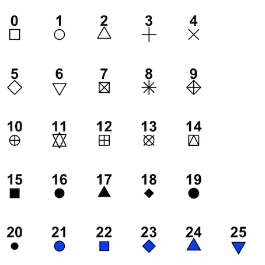

```{r setup, include=FALSE}
knitr::opts_chunk$set(echo = TRUE)
```

## Gráfico básico de puntos
- `plot(x,y)`: para dibujar un gráfico básico de puntos siendo $x,y$ vectores numéricos
    - `plot(x)` = `plot(1:length(x),x)`.
    
- `plot(x,función)`: para dibujar el gráfico de una función.

Ejemplo de un gráfico discreto simple:
```{r}
x = c(2,6,4,9,-1)
y = c(1,8,4,-2,4)
plot(x,y)
```

También podemos ajustar los parámetros del gráfico en el chunk para hacerlo más presentable:
```{r primer_plot, fig.cap="Gráfico básico explicando el uso del plot", fig.align='center'}
x = c(2,6,4,9,-1)
y = c(1,8,4,-2,4)
plot(x,y)
```

 Gráfico básico de puntos:
```{r, fig.height = 4, fig.width = 7, fig.align = "center"}
alumnos = c(1:10)
notas = c(2,5,7,9,8,3,5,6,10,7)
plot(alumnos,notas)
```

Si no incorporamos vector `y`, `R` nos va a tomar el parámetro `x` como si fuese el vector de datos `y` y la variable independiente una sucesión sobre los naturales:
```{r fig.cap="Gráfico discreto", fig.align='center'}
plot(2^(1:6))
```

Si queremos representar una función $f(x)$:
```{r fig.cap="Gráfico contínuo", fig.align='center'}
f <- function(x){ sqrt(x) }
plot(f)
```

## Parámetros de la función plot()

- `log`: para indicar que queremos el gráfico en escala logarítmica.
- `main("título")`: para poner título al gráfico. Si en vez de un texto queráis poner una expresión matemática, tenéis que utilizar la función `expression()` .
- `xlab("etiqueta")`: para poner etiqueta al eje $X$.
- `ylab("etiqueta")`: para poner etiqueta al eje $Y$.
- `pch=n`: para elegir el símbolo de los puntos. $n=0,1,...,25$. El valor por defecto es `pch = 1`.
- `cex`: para elegir el tamaño de los símbolos.
- `col="color en inglés"`: para elegir el color de los símbolos. [Gama de colores](http://www.stat.columbia.edu/~tzheng/files/Rcolor.pdf).

#### Parámetro pch - Tipos de símbolos

<div class="aligncenter">


Ejemplo del uso de parámetros con la gráfica de la sucesión de Fibonacci.
```{r, fig.align='center'}
n = 1:20
fib = (1/sqrt(5))*((1+sqrt(5))/2)^n - (1/sqrt(5))*((1-sqrt(5))/2)^n
plot(fib)
```
Agreguemos títulos a los ejes y al gráfico:
```{r, fig.align='center'}
n = 1:20
fib = (1/sqrt(5))*((1+sqrt(5))/2)^n - (1/sqrt(5))*((1-sqrt(5))/2)^n
plot(fib, xlab = "n", ylab = expression(F[n]),
     main = "Sucesión de Fibonacci")
```

Cambiemos el estilo de punto con `pch`:
```{r, fig.align='center'}
n = 1:20
fib = (1/sqrt(5))*((1+sqrt(5))/2)^n - (1/sqrt(5))*((1-sqrt(5))/2)^n
plot(fib, xlab = "n", ylab = expression(F[n]),
     main = "Sucesión de Fibonacci", pch = 21)
```

Modifiquemos el tamaño de los puntos del gráfico:
```{r, fig.align='center'}
n = 1:20
fib = (1/sqrt(5))*((1+sqrt(5))/2)^n - (1/sqrt(5))*((1-sqrt(5))/2)^n
plot(fib, xlab = "n", ylab = expression(F[n]),
     main = "Sucesión de Fibonacci", pch = 21, cex = 2)
```

Seleccionemos otro color para el contorno de los puntos:
```{r, fig.align='center'}
n = 1:20
fib = (1/sqrt(5))*((1+sqrt(5))/2)^n - (1/sqrt(5))*((1-sqrt(5))/2)^n
plot(fib, xlab = "n", ylab = expression(F[n]),
     main = "Sucesión de Fibonacci", pch = 21, cex = 2,
     col = "firebrick4")
```

Ahora, un color para el background de los puntos o relleno:
```{r, fig.align='center'}
n = 1:20
fib = (1/sqrt(5))*((1+sqrt(5))/2)^n - (1/sqrt(5))*((1-sqrt(5))/2)^n
plot(fib, xlab = "n", ylab = expression(F[n]),
     main = "Sucesión de Fibonacci", pch = 21, cex = 2,
     col = "firebrick4", bg = "darkturquoise")
```

Con el parámetro `log` y el eje se puede indicar en cuáles ejes se aplciará un escalado logarítmico:
```{r, fig.align='center'}
n = 1:20
fib = (1/sqrt(5))*((1+sqrt(5))/2)^n - (1/sqrt(5))*((1-sqrt(5))/2)^n
plot(fib, xlab = "n", ylab = expression(log(F[n])),
     main = "Sucesión de Fibonacci", pch = 21, cex = 2,
     col = "firebrick4", bg = "darkturquoise", log = "y")
```

Podemos crear subplots, ya sea que se llenen por filas, `mfrow`, o por columnas, `mfcol`, con la función `par()` donde se especifica el vector matrix que especifica las dimensiones del arreglo. Con `c(2,2)` se indica que se querrá un subplot de dos renglones y dos columnas donde cada entrada contendrá un gráfico. 

```{r, echo=FALSE, fig.width = 7, fig.align = "center", fig.height=6}
n = 1:20
fib = (1/sqrt(5))*((1+sqrt(5))/2)^n - (1/sqrt(5))*((1-sqrt(5))/2)^n
par(mfrow = c(2,2))
plot(fib, xlab = "n", ylab = expression(F[n]),
     main = "Sucesión de Fibonacci", pch = 21, cex = 2,
     col = "firebrick4", bg = "darkturquoise")
plot(fib, xlab = "n", ylab = expression(F[n]),
     main = "Sucesión de Fibonacci - log x", pch = 21, cex = 2,
     col = "firebrick4", bg = "darkturquoise", log = "x")
plot(fib, xlab = "n", ylab = expression(F[n]),
     main = "Sucesión de Fibonacci - log y ", pch = 21, cex = 2,
     col = "firebrick4", bg = "darkturquoise", log = "y")
plot(fib, xlab = "n", ylab = expression(F[n]),
     main = "Sucesión de Fibonacci - log xy", pch = 21, cex = 2,
     col = "firebrick4", bg = "darkturquoise", log = "xy")
```

## Parámetros de la función plot()

- `type`: para elegir el tipo de gráfico que queremos:
    - `p`: puntos (valor por defecto).
    - `l`: líneas rectas que unen los puntos (dichos puntos no tienen símbolo).
    - `b`: líneas rectas que unen los puntos (dichos puntos tienen símbolo). Las líneas no traspasan los puntos.
    - `o`: como el anterior pero en este caso las líneas sí que traspasan los puntos.
    - `h`: histograma de líneas.
    - `s`: histograma de escalones.
    - `n`: para no dibujar los puntos.

Veamos las distintas opciones con un gráfico donde se excluye la opción `n` ya que nos e msotraría nada:
```{r, fig.width = 7, fig.align = "center", fig.height=7.5}
par(mfrow = c(3,2))
x = c(50:59)
y = c(2,9,25,3,100,77,62,54,19,40)
plot(x,y, pch = 23, cex = 2, col = "blue", type = "p")
plot(x,y, pch = 23, cex = 2, col = "blueviolet", type = "l")
plot(x,y, pch = 23, cex = 2, col = "darkolivegreen4", type = "b")
plot(x,y, pch = 23, cex = 2, col = "deeppink", type = "o")
plot(x,y, pch = 23, cex = 2, col = "springgreen", type = "h")
plot(x,y, pch = 23, cex = 2, col = "firebrick1", type = "s")
par(mfrow = c(1,1))
```


## Parámetros de la función plot()

- `lty`: para especificar el tipo de línea.
    - "solid" : $1$: línea continua (valor por defecto).
    - "dashed" : $2$: línea discontinua.
    - "dotted" : $3$: línea de puntos.
    - "dotdash" : $4$: línea que alterna puntos y rayas.
    
- `lwd`: para especificar el grosor de las líneas.
- `xlim`: para modificar el rango del eje $X$.
- `ylim`: para modificar el rango del eje $Y$.
- `xaxp`: para modificar posiciones de las marcas en el eje $X$. Por ejemplo, si se iguala a c(0,10,5)` se crearán 6 rayas igualmente espaciadas en el rango de 0 a 10.
- `yaxp`: para modificar posiciones de las marcas en el eje $Y$.

```{r, fig.width = 7, fig.align = "center", fig.height=10}
par(mfrow = c(4,1))
plot(n, fib, pch = 21, col = "red", bg = "yellow", cex = 1, 
     main = "Fibonacci",
     type = "o", lty = "solid", lwd = 2, 
     xlim = c(1,10), ylim = c(1, 100),
     xaxp = c(1,10,3), yaxp = c(0,100, 10))
plot(n, fib, pch = 21, col = "red", bg = "yellow", cex = 1, 
     main = "Fibonacci",
     type = "o", lty = "dashed", lwd = 2, 
     xlim = c(1,10), ylim = c(1, 100),
     xaxp = c(1,10,5), yaxp = c(0,100, 8))
plot(n, fib, pch = 21, col = "red", bg = "yellow", cex = 1, 
     main = "Fibonacci",
     type = "o", lty = "dotted", lwd = 2, 
     xlim = c(1,10), ylim = c(1, 100),
     xaxp = c(1,10,10), yaxp = c(0,100, 5))
plot(n, fib, pch = 21, col = "red", bg = "yellow", cex = 1, 
     main = "Fibonacci",
     type = "o", lty = "dotdash", lwd = 2, 
     xlim = c(1,10), ylim = c(1, 100),
     xaxp = c(1,10,20), yaxp = c(0,100, 1))
```

```{r, fig.height = 4, fig.width = 9, fig.align = "center"}
x = (2*(1:20))
y = (-1)^(1:20)*5*(1:20)
plot(x,y, main = "Ejemplo de grafico", pch = 8, cex = 1, type = "b", lty = 4, lwd = 4, 
     xaxp = c(0,40,2), yaxp = c(-100,100,8))
```


## Añadir elementos al gráfico

- `points(x,y)`: añade un punto de coordenadas $(x, y)$ a un gráfico ya existente
- `abline`: para añadir una recta a un gráfico ya existente
    - `abline(a,b)`: añade la recta $y=bx+a$
    - `abline(v = x0)`: añade la recta vertical $x=x_0$. $v$ puede estar asignado a un vector
    - `abline(h = y0)`:  añade la recta horizontal $y=y_0$. $h$ puede estar asignado a un vector
 
Tomemos de ejemplo la gráfica anterior al añadirle un punto y una recta:
```{r, fig.width = 9, fig.align = "center"}
x = (2*(1:20))
y = (-1)^(1:20)*5*(1:20)
plot(x,y, main = "Poniendo un punto y una recta", pch = 8, cex = 1, type = "b", lty = 4, 
     lwd = 4, xaxp = c(0,40,2), yaxp = c(-100,100,8))
points(20,0, col = "red", cex = 4, pch = 16)
abline (h = 0, lty = 2, lwd = 2, col = "dodgerblue")
```
A continuacións e mostrarán varios ejemplos:
```{r}
f <- function(x){
  x^2 -2*x + sqrt(abs(x))
}
plot(f, xlim = c(-3,3))
points(0,0, pch = 19)
points(-3:3, (-3:3)^2, col = "blue") # Parábóla centrada original.
abline(2,3, lty = "dashed", lwd = 3, col = "red") # Recta con pendiente 3.
abline(v = 2, lty = "dotted", lwd = 3, col = "green") # Recta vertical en x=2.
abline(h = 5, lty = "dotdash", lwd = 3, col = "gray") # Recta horizontal en y=5.
```

Crear un mallado o _grid_ con una serie de rectas verticales y horizontales igualmente espaciadas:
```{r}
f <- function(x){x^2}
plot(f, xlim = c(-3,3), col = "red", lwd = 2, ylab = expression(y^2), xlab = "x")
abline(h=0:9, v = -3:3, lty="dotted", lwd = 2, col = "grey")
```

Crear rectas situadas en las asintotas verticales de la función tangente:
```{r}
plot(tan, xlim = c(-pi, pi), ylim = c(-5,5))
abline(v = c(-pi/2, pi/2), col = "red")
```


## Añadir elementos al gráfico

- `text(x,y,labels = "....")`: añade en el punto de coordenadas $(x,y)$ el texto especificado como argumento de labels
    - `pos`: permite indicar la posición del texto alrededor de las coordenadas $(x,y)$. Admite los siguientes valores:
        - 1: abajo
        - 2: izquierda
        - 3: arriba
        - 4: derecha
        - 5: sin especificar: el texto se sitúa centrado en el punto $(x,y)$
        

```{r}
plot(0,0)
text(0,0, labels = "debajo", pos = 1)
text(0,0, labels = "izquierda", pos = 2)
text(0,0, labels = "arriba", pos = 3)
text(0,0, labels = "derecha", pos = 4)
points(0,1)
text(0,1, labels = "centro")
```

En el sigueinte ejemplo se muestran las primeras 8 etiquetas de texto arriba del punto, mientras que las dos últimas, en diferente posición una respecto a la otra:
```{r, fig.width = 9, fig.height = 3.75,fig.align = "center"}
alumnos = c(1:10)
notas = c(2,5,7,9,8,3,5,6,10,7)
plot(alumnos,notas, main = "Grafico con texto")
text(alumnos,notas, labels = c("S","A","N","E","N","S","A","A","E","N"), 
     pos = c(rep(3,times = 8),1,3))
```
## Añadir elementos al gráfico

- `lines(x, y)`:añade a un gráfico existente una línea poligonal que une los puntos $(x_i, y_i)$ sucesivos. $x,y$ son vectores numéricos.
- `curve(curva)`: permite añadir la gráfica de una curva a un gráfico existente.
    - `add=TRUE`: si no, la curva no se añade.
    - La curva se puede especificar mediante una expresión algebraica con variable $x$, o mediante su nombre si la hemos definido antes.

Veamos un ejemplo sencillo:
```{r, results='hide', fig.align="center", fig.height=4}
x = c(5*(1:20))
plot(x,c(exp(-x)+(-1)^x*x/2*sin(x)^2)) # Puntos vacíos
lines(c(20,10,40,80,60,60,20),c(20,0,-20,-20,40,0,20), 
      lwd = 2, col = "deepskyblue4") # Notemos que los puntos inciales y finales son iguales para que sea una figura cerrada
curve(20*sin(x), add = TRUE,
      col = "green")
```

## Añadir elementos al gráfico

- `legend(posición, legend = ...)`: para añadir una leyenda.
    - La posición indica donde queremos situar la leyenda. Puede ser o bien las coordenadas de la esquina superior izquierda de nuestra leyenda, o bien una de las palabras siguientes:
        - "bottom" / "bottomright" / "bottomleft".
        - "top" / "topright" / "topleft".
        - "center" / "right" / "left".
        
    - `legend`: contiene el vector de nombres entre comillas con los que queremos identificar a las curvas en la leyenda.

En el siguiente ejemplo se graficarán varias curvsa, en las cuales las leyendas mostrarán el mismo tipo de línea y color con el el que fue graficada la función a la que etiquetan.
```{r}
f <- function(x){x^2}
plot(f, xlim = c(-3,3), ylim = c(-10,10))
points(-3:3, f(-3:3), pch = 19)
lines(-3:3, f(-3:3), 
      lwd = 2, lty = "dotted", 
      col = "red")
curve(x^3, lty = "dashed", 
      col = "blue", add = TRUE)
curve(x^4, lty = "dashed", 
      col = "orangered", add=TRUE)
legend("bottomright", 
       legend = c(expression(x^2), expression(x^3), expression(x^4)), # En el mismo orden que aparecen las gráficas en el código
       lwd = 2, 
       col = c("red", "blue", "orangered"), # Los colores en el orden respectivo a las gráficas
       lty = c("dotted", "dashed", "dashed") # Estilo del línea en el orden respectivo a las gráficas
       )
```

EL siguiente ejemplo es similar al anterior, pero en este las líneas tiene el estilo dado por defecto:
```{r, fig.align="center"}
x = seq(0,2*pi,0.1)
plot(x, sin(x),
     type="l",col="blue",
     lwd=3, xlab="", ylab="")
lines(x, cos(x),
      col="green",lwd=3)
lines(x, tan(x),
      col="purple",lwd=3)
legend("bottomleft",
       col=c("blue","green","purple"),
       legend=c("Seno","Coseno", "Tangente"), 
       lwd=3, bty="l")
```

## Añadir elementos al gráfico

- `segments`: para añadir segmentos a un gráfico existente.
- `arrows`: para añadir flechas a un gráfico existente.
- `symbols`: para añadir símbolos a un gráfico existente.
- `polygon`: para añadir polígonos cerrados especificando sus vértices a un gráfico existente.


```{r, fig.align="center"}
x = c(5*(1:10))
plot(x,c(exp(-x)+(-1)^x*x/2*sin(x)^2), xlab = "", ylab = "", 
     main = "Grafico con varios elementos")
segments(10,0, # Coordinates of points from which to draw
         40,0, # Coordinates of points to which to draw. At least one must the supplied
         col = "red", lwd = 4)
arrows(10,0, # Coordinates of points from which to draw
       40,-10, # Coordinates of points to which to draw. At least one must the supplied
       col = " blue",
       length = 0.5, # Length of the edges of the arrow head (in inches)
       angle = 5, # Angle from the shaft of the arrow to the edge of the arrow head
       code = 3) # Integer code, determining kind of arrows to be drawn
# Inner star:
symbols(40,0, # The x and y co-ordinates for the centres of the symbols. They can be specified in any way which is accepted by xy.coords.
        stars = cbind(1,.5,1,.5,1,.5,1,.5,1,.5), # A matrix with three or more columns giving the lengths of the rays from the center of the stars. NA values are replaced by zeroes.
        add = TRUE, # If add is TRUE, the symbols are added to an existing plot, otherwise a new plot is created.
        lwd = 3,
        inches = 0.5) # Argument inches controls the sizes of the symbols. If TRUE (the default), the symbols are scaled so that the largest dimension of any symbol is one inch. If a positive number is given the symbols are scaled to make largest dimension this size in inches (so TRUE and 1 are equivalent). If inches is FALSE, the units are taken to be those of the appropriate axes. (For circles, squares and stars the units of the x axis are used. For boxplots, the lengths of the whiskers are regarded as dimensions alongside width and height when scaling by inches, and are otherwise interpreted in the units of the y axis.) 
# Outter star:
symbols(40,0,
        stars = cbind(1,.5,1,.5,1,.5,1,.5,1,.5),
        add = TRUE,
        lwd = 3)
polygon(c(20,30,40),c(10,-10,10), # Vectors containing the coordinates of the vertices of the polygon.
        col = "gold",
        density = 3, # The density of shading lines, in lines per inch. The default value of NULL means that no shading lines are drawn. A zero value of density means no shading nor filling whereas negative values and NA suppress shading (and so allow color filling).
        angle = 90, # Te slope of shading lines, given as an angle in degrees (counter-clockwise).
        lty = 4, lwd = 5)
```